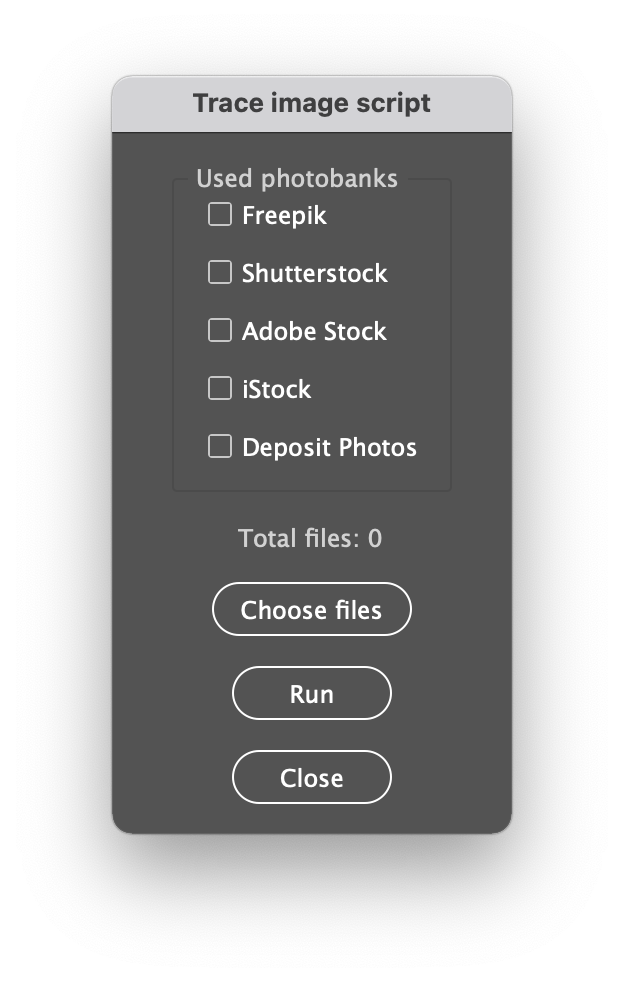

# Скрипт автоматической трассировки для Adobe Illustrator [Beta]


Скрипт автоматически трассирует с помощью Adobe Illustrator выбранные растровые файлы 
и сохраняет их в EPS в соответствии с требованиям к дистрибуции стоков



## Поддерживаемые стоки
* Freepik (eps, jpg)
* Shutterstock (jpg)
* Adobe Stock (eps, jpg)
* iStock (eps, jpg)
* Deposit Photos (eps, jpg)

## Требования
* Adobe Illustrator

## Релиз
[v0.1.0](https://github.com/devoll/trace-image-batch-ai/releases/tag/v0.1.0)

## Как воспользоваться скриптом
1. Скачайте(ссылка) файл скрипта
2. Поместите файл скрипта в директорию `scripts`:
    * для MacOS: `/Applications/Adobe Illustrator 2021/Presets/en-GB/Scripts/`
    * для Windows: `C:\Program Files\Adobe\Adobe Illustrator 2021\Presets\en_GB\Scripts\`
3. Запустите `Adobe Illustrator` и в меню `Файл -> Скрипты` (`File -> Sctipts`) выберите скрипт для запуска.

## Как собрать скрипт последней версии

Для сборки вам необходимы следующие установленные инструменты:

* NodeJS
* NPM
* Git

```bash
git clone https://github.com/devoll/trace-image-batch-ai.git
cd trace-image-batch-ai
npm install
npm run build
```

После завершения сборки заберите собранную версию скрипта из `dist`

## ToDo
- Добавить интерфейс с информацией о кол-ве обработанных файлов и кол-ве ошибочных
- Добавить фикс входного изображения для проверки FreePic
- Чинить вектор -> Переводить в Expand shape
- Добавить дополнительный скрипт для работы с вектором

### [CHANGELOG](CHANGELOG.md)
